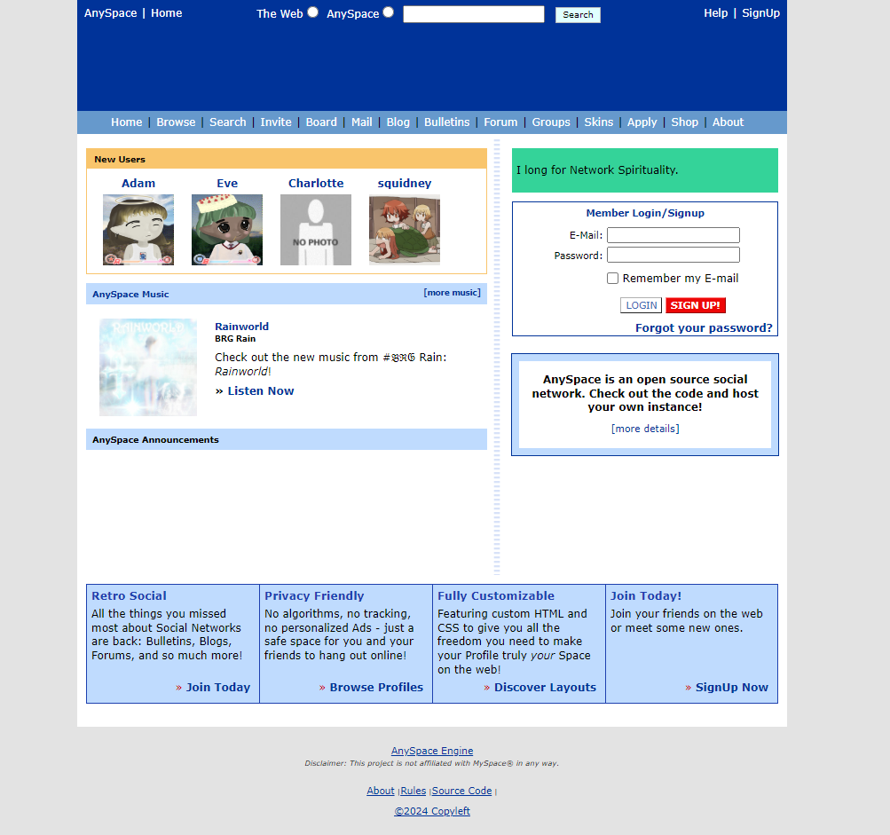

# AnySpace 
AnySpace is an Open Source Social Network similar to MySpace circa 2005 

## Install

1. Clone repo and transfer files to webserver
2. Create database and update settings in `config.php`
3. Set site and domain name in `config.php`
4. Navigate to `http://<DOMAIN-NAME>/install.php` 

## Features

- [ ] Authentication
  - [x] Login/Logout
  - [x] Registration
  - [ ] Password Reset
  - [ ] Email Verification
- [ ] Blog
- [ ] Bulletins
- [ ] Comment System
- [ ] Forum
- [x] Friend System
- [ ] Group System
- [ ] Private Messaging
- [x] User Browser
- [x] User Search
- [x] User Profiles
  - [x] Profile Editing 
  - [x] Custom CSS (untested)

## Screenshot

